# README

## DL Link
https://drive.google.com/drive/folders/1fg2BLdyyFPhFgZ8oYdBHFWeM1Is8eOso?usp=sharing

Fighting Game Scoreboard Control

A desktop app built with Wails
for managing fighting game tournaments.
Easily control scoreboards, commentators, brackets, and sponsor logos, and use them directly in OBS through local overlays.

## Platform
Windows

## Changelog 

### 1.0.2

Added streamer mode.
Streamer mode allows the scoreboard to be opened in a separate windows, because the main app is too big and not suitable for fast-paced fighting game tournament environment. Because it's html, it's also possible to use Custom Browser Docks from OBS to pin the html into OBS.

Just add this line to custom docks when the scoreboard is open

> http://localhost:34115/miniscoreboard.html

### emerge-release

Fixed frontend file issue
if localhost 34115 cant be accessed, try "34116" or "34117" (e.g. http://localhost:34116/scoreboard.html)

### 1.0.1

Fixed Double Bracket losers semi placement issue
Fixed truncating names in scoreboard overlay
added csv to help PlayerName input

### 1.0.0

Initial Release

## Screenshots

 <h2> Interface </h2>
 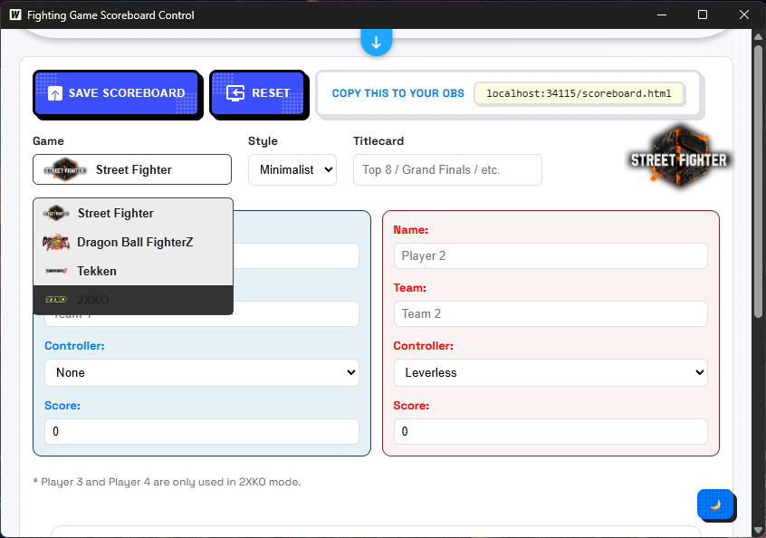
 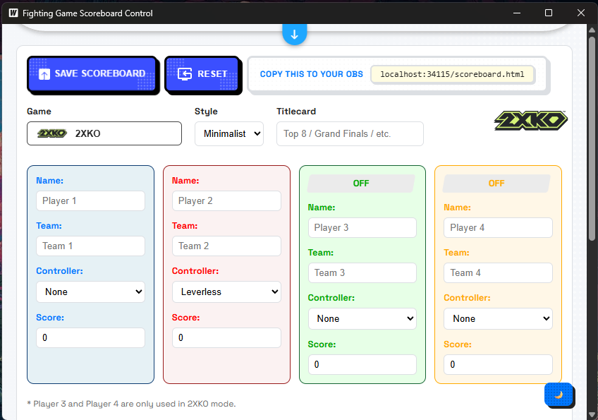
 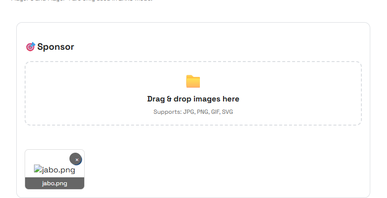  
 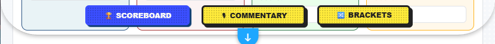
 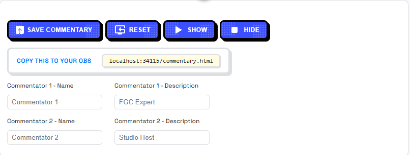
 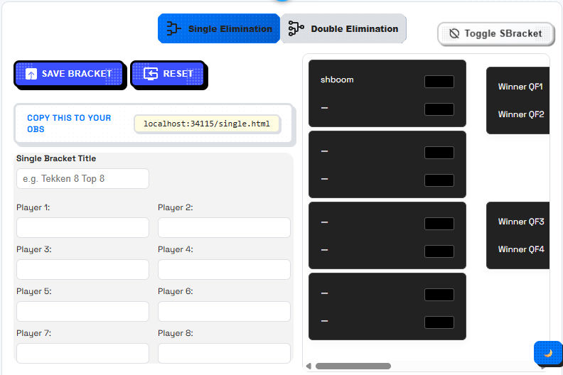
 <h2> Some Overlay Screenshots </h2>
 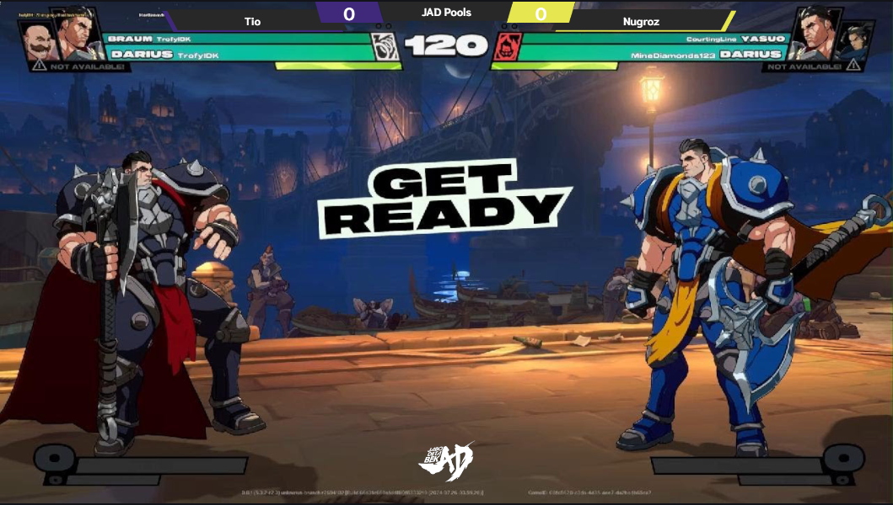
 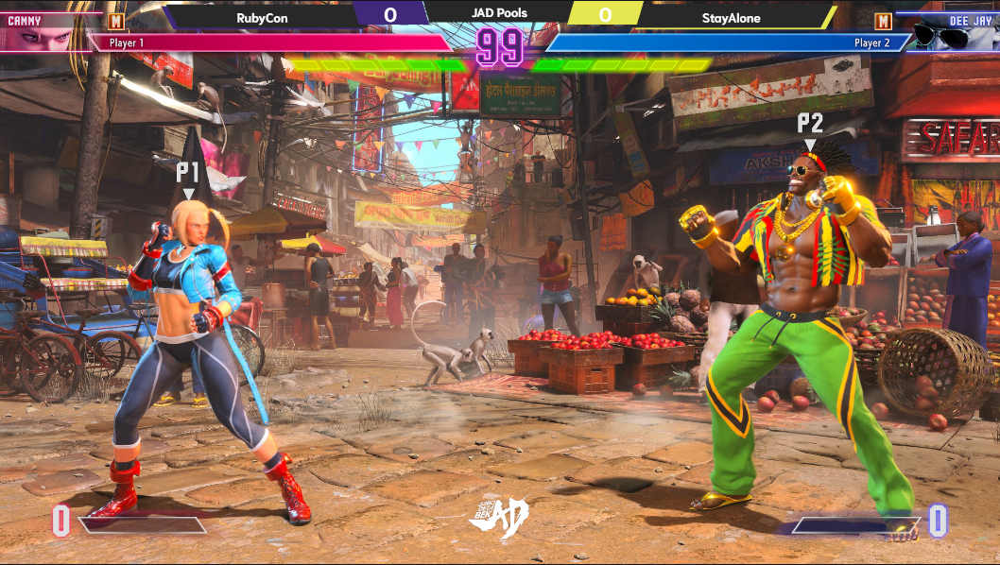
 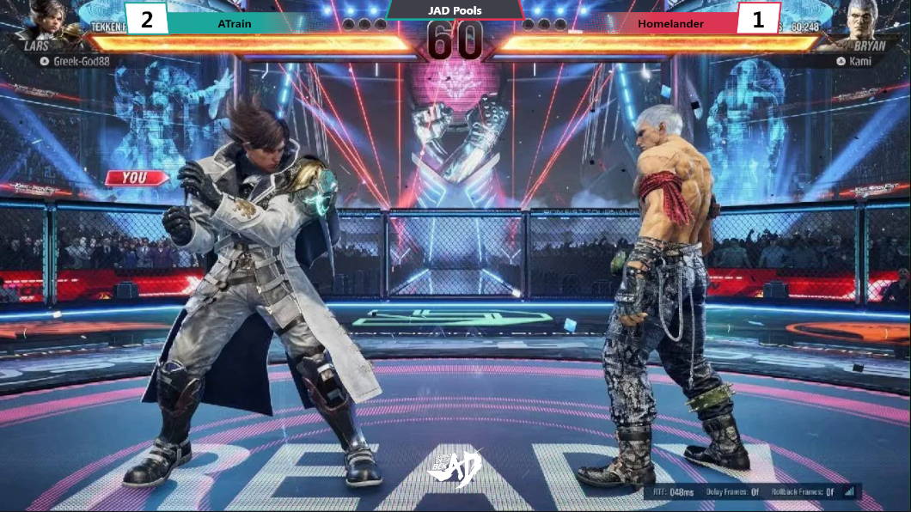
 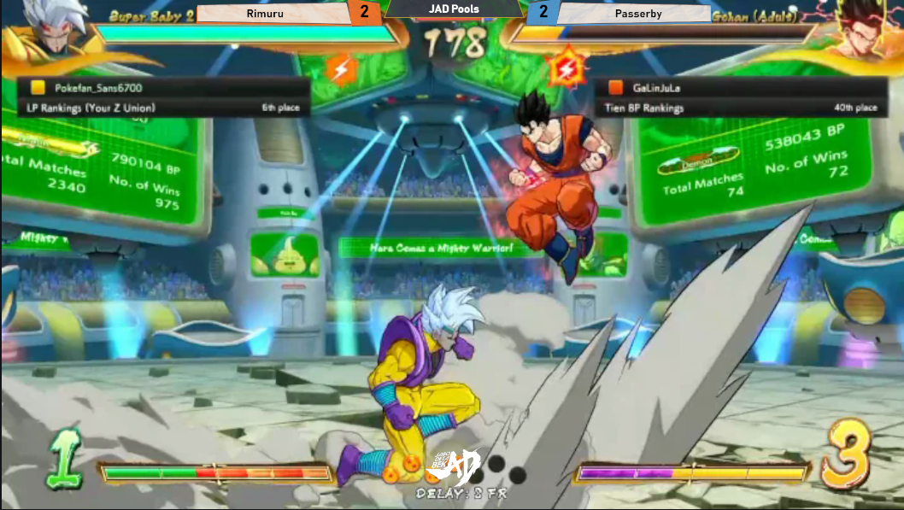
 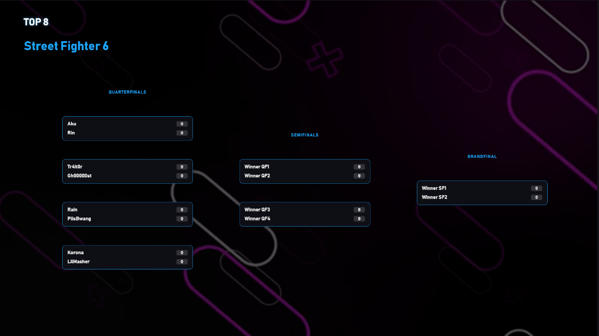

## Features:

- Scoreboard Control – Player names, teams, controllers, visibility, titlecards

- Commentary Overlay – Two-caster layout with names and roles

- Brackets – Single & Double Elimination visualization

- Sponsors – Auto-detect logos placed in /frontend/sponsors

- Auto JSON Save – All overlay data stored locally

- Built-in Local Web Server – Overlays served on http://localhost:34115
 

 ## Shortcuts:

- Ctrl + S - save Scoreboard, Commentator, and Brackets
  
- Ctrl + R - reset Scoreboard, Commentator, and Brackets
  
- Alt + [1,2,3] - Switch between Scoreboard, Commentator, and Brackets tab

- Alt + S - Show Commentators

- Alt + D - Hide Commentators
  
- Try inputting Konami Code

  
## How to Use (for Users)

After downloading the ZIP:

Extract it anywhere

Run the app

It opens a desktop control panel

It starts a local server on http://localhost:34115

In OBS, add Browser Sources:

Overlay	URL
Scoreboard	http://localhost:34115/scoreboard.html
Commentary	http://localhost:34115/commentary.html
Single Elim	http://localhost:34115/single.html
Double Elim	http://localhost:34115/double.html

Set Width & Height in OBS as needed (e.g. 1280×720)

To show sponsors, place logo images inside the sponsors folder:

build/bin/sponsors/

They will automatically appear in rotation on overlays.

Folder Structure (Source)
frontend/
scoreboard.html     # Scoreboard overlay
commentary.html     # Commentary overlay
single.html         # Single elim bracket overlay
double.html         # Double elim bracket overlay
sponsors/           # Sponsor logos (auto-detected)
app.go                   # App logic (scoreboard, commentary, brackets, sponsors)
main.go                  # Wails entry point + overlay webserver

# Streamer Mode

I realized this app is kinda big on it's size, so i made a mini-window for the scoreboard only.
You can access it in 2 ways

1. From the app, just press "Stream Mode" button on top right, a window  will pop-up and it'll do the same thing the scoreboard tab do
   
2. You can use OBS Custom Browser Docks, just paste localhost:34115/miniscoreboard.html (34115 is default port, adjust if you use 34116 or 34117), and you're done.

## Requirements (for Developers)

To build or run from source, make sure you have:

Go 1.21+

Node.js 18+

Wails CLI

// Run in Development
wails dev

This launches:

the control panel app (desktop window)

the overlay web server at http://localhost:34115

You can test your overlays in a browser or in OBS.

// Build a Release Version
wails build

Your compiled app will be located in:

./build/bin/

When you run the .exe, it will automatically start the overlay webserver on port 34115.

//Sharing Your App

If you want to share your built version with other users:

Navigate to build/bin/

Zip the folder contents (include the .exe + frontend + sponsors)

Upload the ZIP to GitHub Releases (e.g. v1.0.0)

// Notes

Overlays are static HTML files served locally by the app

Data is written as JSON in /frontend (e.g. scoreboard.json)

sponsors.json is auto-generated when adding/deleting images

You can safely edit overlays' design if you know HTML/CSS

// Troubleshooting
Issue	Cause	Fix
 “Overlay not loading in OBS”	App isn’t running or port conflict	Make sure the app is open. Check if another app uses port 34115.
 “Sponsors not showing”	Folder is empty or wrong path	Place your images in build/bin/sponsors/ and restart the app.
 “Changes not appearing”	Cached overlay in OBS	Right-click browser source → Refresh, or restart OBS.
 “Firewall warning”	Windows blocking local server	Click “Allow access” when prompted.
 “Double-click does nothing”	Missing files or moved exe	Keep frontend folder next to .exe. Don’t move them separately.

💡 Tip: If you’re using a custom port, edit main.go → ListenAndServe(":34115") and rebuild.

🧭 Versioning & Releases

This project uses semantic versioning:

Version	Description
v1.0.0	First public release (scoreboard, commentary, brackets, sponsors)

## License
Usage is provided under the [MIT License](http://http//opensource.org/licenses/mit-license.php). See LICENSE for the full details.
